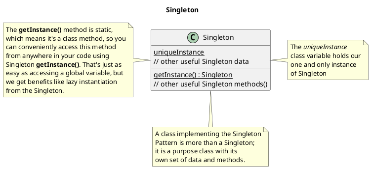

> A page to test various markdown plugins features

## Directives

::youtube[Video of a cat in a box]{#01ab2cd3efg}

## Math

Lift($L$) can be determined by Lift Coefficient ($C_L$) like the following
equation.

$$
L = \frac{1}{2} \rho v^2 S C_L
$$

## Code

(nothing here yet)

```js
function hello() {
  console.log("Hello World!");
}
```

## Simple PlantUML



